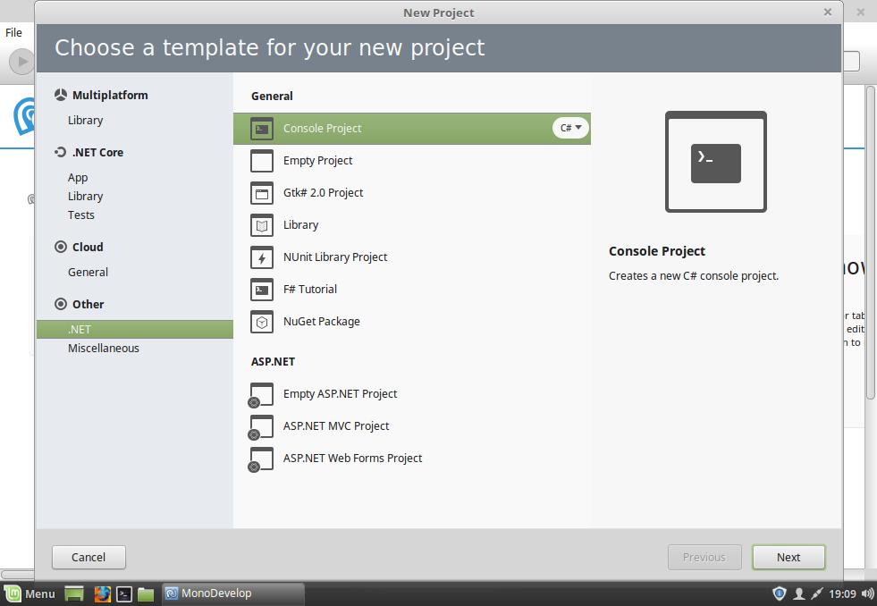
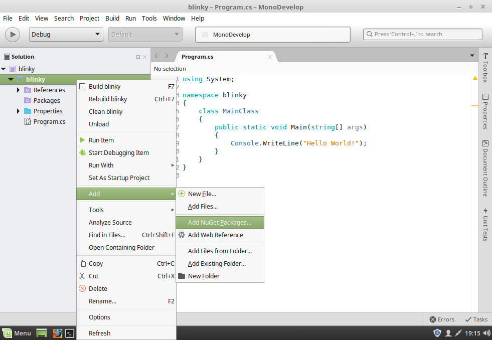
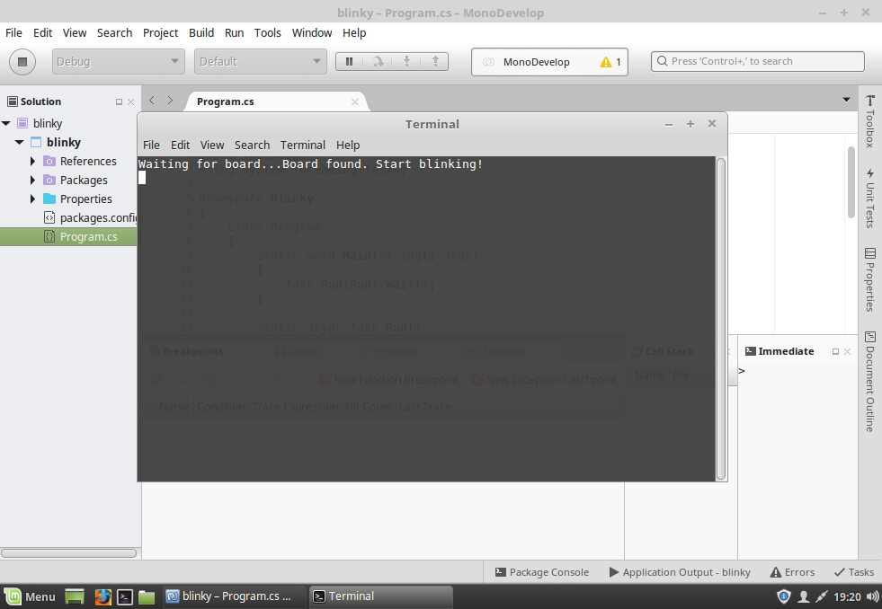

\page linux Linux
Treehopper's C# API has Linux support through direct calls into [libusb-1.0](http://libusb.info/), the ubiquitous USB library that's found on almost every Linux device out there. Other than a .NET build system, no Treehopper-specific native libraries are required when developing or deploying applications that use %Treehopper.

## Prerequisites
You can build C# Linux apps that connect to %Treehopper using both the classic [Mono Project](https://www.mono-project.com/) runtime, or the new [.NET Core 2.0](https://www.microsoft.com/net/learn/get-started/linux/rhel) environment.

If you have an old version of .NET Core, please make sure to update it before proceeding; %Treehopper targets .NET Core 2.0 or later.

### IDEs
The .NET Core 2.0 SDK is well-suited to developers looking for a command-line development environment. While you can use any text editor you'd like, if you jump around between .NET, Javascript, Python, and other languages, [Visual Studio Code](https://code.visualstudio.com/download) is a great lightweight text editor that has good support for .NET Core (including debugging).

On the other hand, if you want to build projects that target Mono, you'll probably want an IDE, as Mono uses a build system that's difficult to configure by hand.

For this, we recommend using [MonoDevelop](http://www.monodevelop.com/download/#fndtn-download-lin) or [JetBrains Rider](https://www.jetbrains.com/rider/), which will provide a GUI interface for configuring the mono build system.

Both Rider and MonoDevelop provide good support for .NET Core apps, so you may wish to install one of them regardless of the runtime you're targeting.

Note that if you want to use the mono build system and runtime without using MonoDevelop, you can install the mono-complete package following the directions [here](https://www.mono-project.com/download/stable/#download-lin-ubuntu). This package is included with MonoDevelop, but you'll need it if you're using Rider, which isn't packaged with Mono.

## MonoDevelop Flatpak headaches
For a brief period, MonoDevelop was solely distributed as a FlatPak image. When MonoDevelop is running in a Flatpak-based environment, debugging an app that uses %Treehopper will fail, as libusb is unavailable in this execution context.

The MonoDevelop maintainers must have read our minds, because MonoDevelop has returned to standard package repos for many major Linux distributions. If you have an old Flatpak-based MonoDevelop installation, please uninstall it and install a repo-based version, as documented [here](http://www.monodevelop.com/download/#fndtn-download-lin).

### udev rules
By default, most Linux-based operating systems restrict normal users from interacting with USB devices. To enable non-root users to interact with %Treehopper boards, you must add a udev rule.

Paste and run this quick snippet into a terminal window:
```
> sudo echo "SUBSYSTEM==\"usb\", ATTRS{idVendor}==\"10c4\", ATTRS{idProduct}==\"8a7e\", MODE:=\"666\", GROUP=\"users\"" > /etc/udev/rules.d/999-treehopper.rules
```
Verify the rule was created:
```
> cat /etc/udev/rules.d/999-treehopper.rules 

SUBSYSTEM=="usb", ATTRS{idVendor}=="10c4", ATTRS{idProduct}=="8a7e", MODE:="666", GROUP="users"
```

Note that, for some distributions, `sudo` may not be configured to allow this. You can launch a root shell and repeat the command.
```
> sudo su
# echo "SUBSYSTEM==\"usb\", ATTRS{idVendor}==\"10c4\", ATTRS{idProduct}==\"8a7e\", MODE:=\"666\", GROUP=\"users\"" > /etc/udev/rules.d/999-treehopper.rules
```

# Blinky in .NET Core Console {#linux-dotnet-core}
We can build a console application that targets .NET Core 2.0. The .NET binaries produced can run on both Linux and Windows.

We'll create the .NET Core project on the command line, but it's just as easy to create it from MonoDevelop or Rider.

### Step 1: Create a new project
Create a new folder called "blinky" and execute `dotnet new console` from it to create a new .NET Core console application.

```
> mkdir blinky
> cd blinky
> dotnet new console
```

### Step 2: Add the %Treehopper and %Treehopper.Desktop NuGet packages
The %Treehopper NuGet package contains all the core %Treehopper functionality. %Treehopper.Desktop contains code needed to use %Treehopper with Windows, macOS, or Linux hosts.

Add these packages to your project:
```
> dotnet add package Treehopper
> dotnet add package Treehopper.Desktop
```
Explicitly adding both packages is actually redundant, since if we add the %Treehopper.Desktop NuGet package to the project, it will automatically pull in %Treehopper as a dependency.

### Step 3: Edit Program.cs
Open Program.cs in a text editor and edit it to look like the following:

```CS
using System;
using Treehopper;
using System.Threading.Tasks;

namespace blinky
{
    class Program
    {
        static void Main(string[] args)
        {
            Task.Run(Run).Wait();
        }

        static async Task Run()
        {
            Console.Write("Waiting for board...");
            // hang around until we find the first board attached
            var board = await ConnectionService.Instance.GetFirstDeviceAsync();
            Console.WriteLine("Board found. Start blinking!");
            await board.ConnectAsync(); // always connect before using a board
            while(board.IsConnected) // run until the board is disconnected
            {
                board.Led = !board.Led; // read the current LED and invert it
                await Task.Delay(100);  // wait 100 ms
            }
        }
    }
}
```

### Step 4: Build and run
You can build and run the app by executing
```
> dotnet run
```

By the way, if you ever want to explicitly `clean` or `build` a project, those are valid commands, too.

You should see the LED start blinking continuously once your program launches. If the LED doesn't work or there are errors, check that you copied the code properly and that you added the udev rules as mentioned above.

# Blinky in Mono {#linux-mono}
We can build a console application that targets .NET Framework 4.6.1+. Console .NET Framework apps are the easiest way to produce a cross-platform binary that can be run on macOS, Linux, and Windows without recompiling.

We'll create a Mono .NET Framework Console app using MonoDevelop, but if you're using Rider, it will be a similar process.


### Step 1: Create a new project
Create a new .NET Console solution named "blinky" in the directory of your choosing.


### Step 2: Add the %Treehopper and %Treehopper.Desktop NuGet packages
The %Treehopper NuGet package contains all the core board functionality. %Treehopper.Desktop contains code needed to use %Treehopper with Windows, macOS, or Linux hosts.

To add these packages, right-click on the blinky project (not the solution), and choose **Add > Add Nuget Packages...**. Search for %Treehopper and add both %Treehopper and %Treehopper.Desktop.

Explicitly adding both packages is actually redundant, since if we add the %Treehopper.Desktop NuGet package to the project, it will automatically pull in %Treehopper as a dependency.


### Step 3: Edit Program.cs
Open Program.cs and edit it to look like the following:

```CS
using System;
using Treehopper;
using System.Threading.Tasks;

namespace blinky
{
    class Program
    {
        static void Main(string[] args)
        {
            Task.Run(Run).Wait();
        }

        static async Task Run()
        {
            Console.Write("Waiting for board...");
            // hang around until we find the first board attached
            var board = await ConnectionService.Instance.GetFirstDeviceAsync(); 
            Console.WriteLine("Board found. Start blinking!");
            await board.ConnectAsync(); // always connect before using a board
            while(board.IsConnected) // run until the board is disconnected
            {
                board.Led = !board.Led; // read the current LED and invert it
                await Task.Delay(100);  // wait 100 ms
            }
        }
    }
}
```


### Step 4: Build and run
Hit the play button in the top left to build and launch your app.

You should see the LED start blinking continuously once your program launches. If the LED doesn't work or there are errors, check that you copied the code properly and that you added the udev rules as mentioned above.

# Next steps
Before moving on, make sure you're familiar with what's going on in the code. What happens if you start up the app before plugging in a board?

As a next step, try hooking up an LED to Pin 0 and edit the program to toggle that pin instead of the onboard LED (Hint, check out Pin.ToggleOutput()).

From here, you can dive right into using other peripherals on %Treehopper, as well as components from %Treehopper.Libraries (make sure to add the %Treehopper.Libraries NuGet package first!).