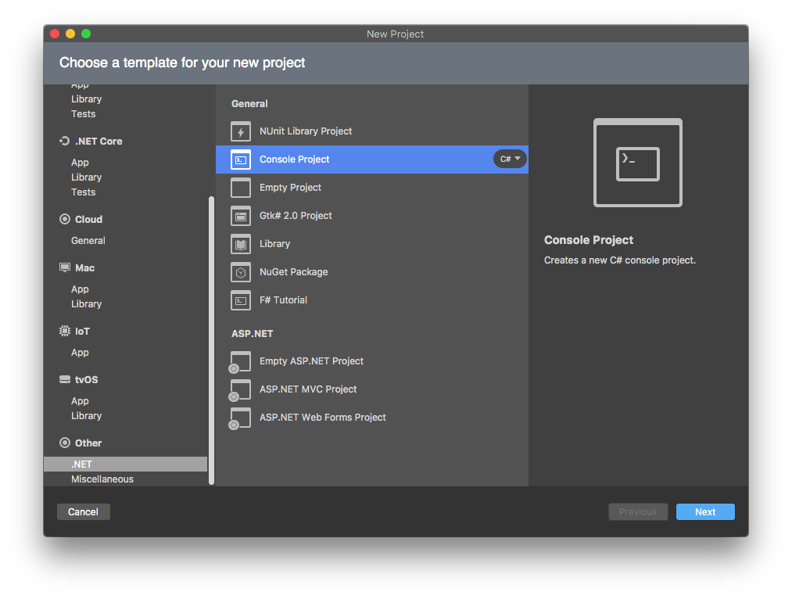
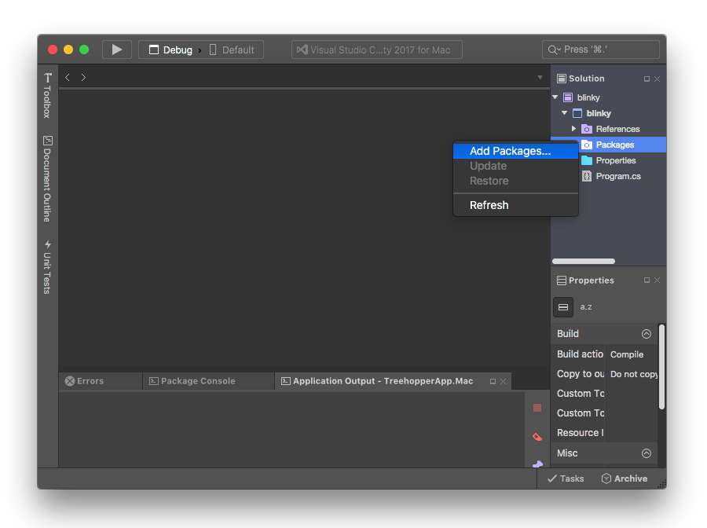
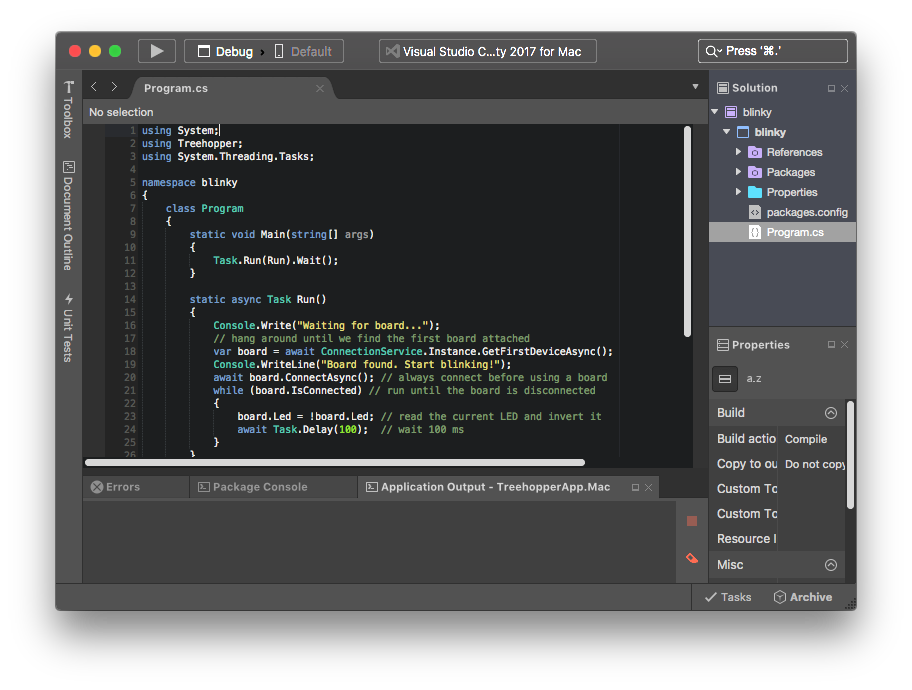
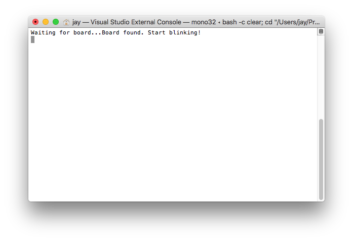

\page mac macOS

You can write C# .NET apps that use %Treehopper on macOS using Mono (formerly maintained by Xamarin, but now by Microsoft itself).

## Prerequisites
We'll be using [Microsoft Visual Studio for Mac](https://www.visualstudio.com/vs/mac/), a free IDE based on MonoDevelop, in this Getting Started guide.

# Blinky in a Cross-Platform Console App
We can build a console application that targets .NET Framework 4.6.1+. Console .NET Framework apps are the easiest way to produce a cross-platform binary that can be run on macOS, Linux, and Windows without recompiling.


### Step 1: Create a new project
Start Visual Studio for Mac, and create a new **.NET Console Project** named "blinky" in the directory of your choosing. 

\note
This project type is found at the bottom, in the **Other** category --- do not use the .NET Core Console project type, as %Treehopper does not currently support .NET Core apps running on macOS.


### Step 2: Add the %Treehopper and %Treehopper.Desktop NuGet packages
The %Treehopper NuGet package contains all the core board functionality. %Treehopper.Desktop contains code needed to use %Treehopper with Windows, macOS, or Linux hosts.

To add these packages, right-click on the blinky project (not the solution), and choose **Add > Add Nuget Packages...**. Search for %Treehopper and add both %Treehopper and %Treehopper.Desktop.

Explicitly adding both packages is actually redundant, since if we add the %Treehopper.Desktop NuGet package to the project, it will automatically pull in %Treehopper as a dependency.


### Step 3: Edit Program.cs
Open Program.cs and edit it to look like the following:

```CS
using System;
using Treehopper;
using System.Threading.Tasks;

namespace blinky
{
    class Program
    {
        static void Main(string[] args)
        {
            Task.Run(Run).Wait();
        }

        static async Task Run()
        {
            Console.Write("Waiting for board...");
            // hang around until we find the first board attached
            var board = await ConnectionService.Instance.GetFirstDeviceAsync(); 
            Console.WriteLine("Board found. Start blinking!");
            await board.ConnectAsync(); // always connect before using a board
            while(board.IsConnected) // run until the board is disconnected
            {
                board.Led = !board.Led; // read the current LED and invert it
                await Task.Delay(100);  // wait 100 ms
            }
        }
    }
}
```


### Step 4: Build and run
Hit the play button in the top left to build and launch your app.

You should see the LED start blinking continuously once your program launches. If the LED doesn't work or there are errors, check that you copied the code properly and that you added the udev rules as mentioned above.

# Next steps
Before moving on, make sure you're familiar with what's going on in the code. What happens if you start up the app before plugging in a board?

As a next step, try hooking up an LED to Pin 0 and edit the program to toggle that pin instead of the onboard LED (Hint, check out Pin.ToggleOutput()).

From here, you can dive right into using other peripherals on %Treehopper, as well as components from %Treehopper.Libraries (make sure to add the %Treehopper.Libraries NuGet package first!).