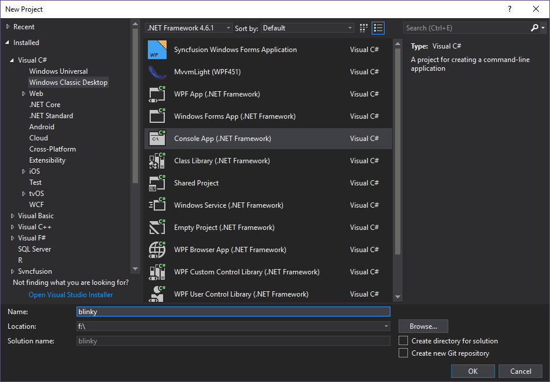
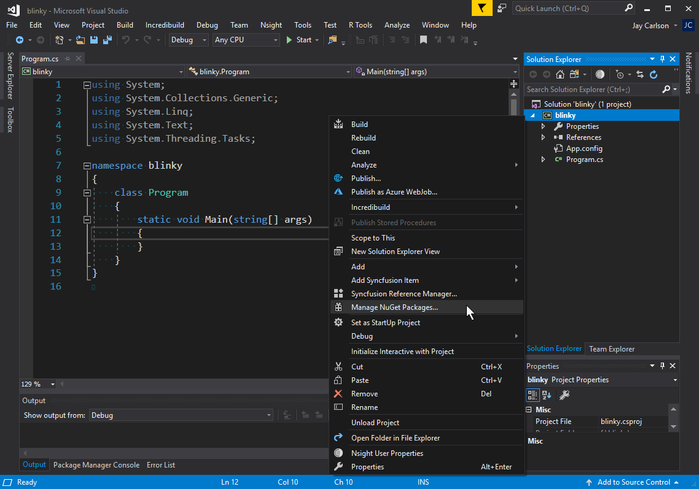
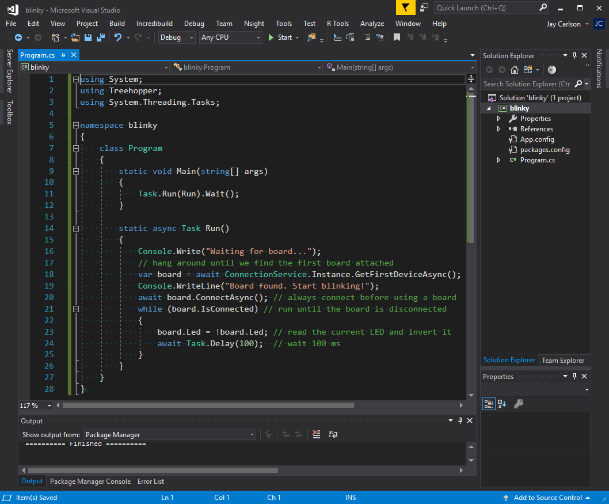
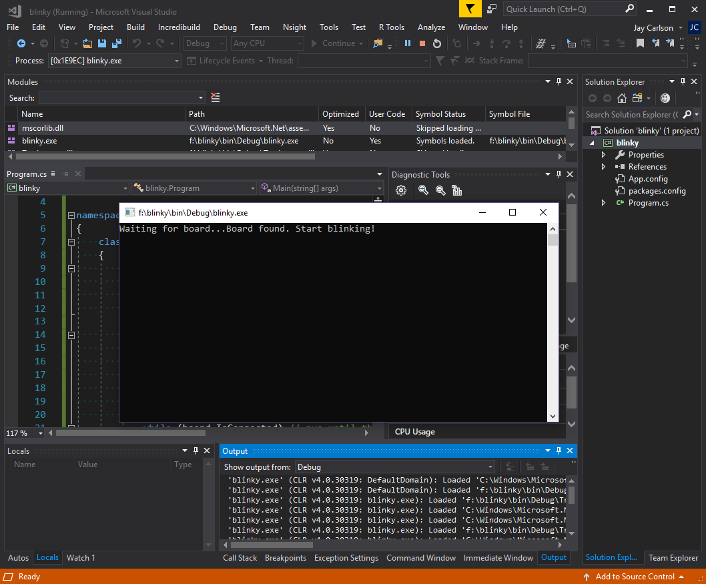
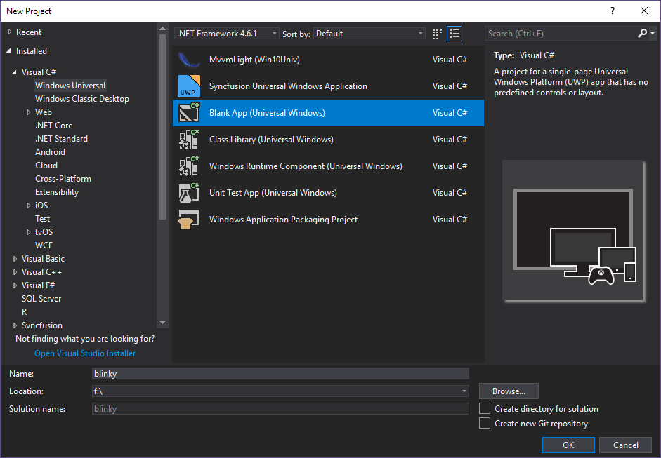
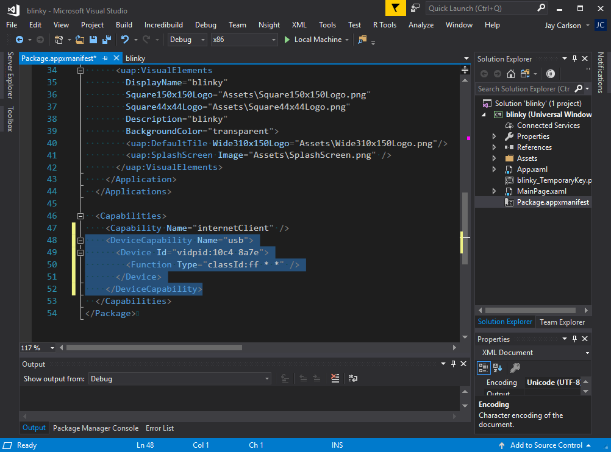
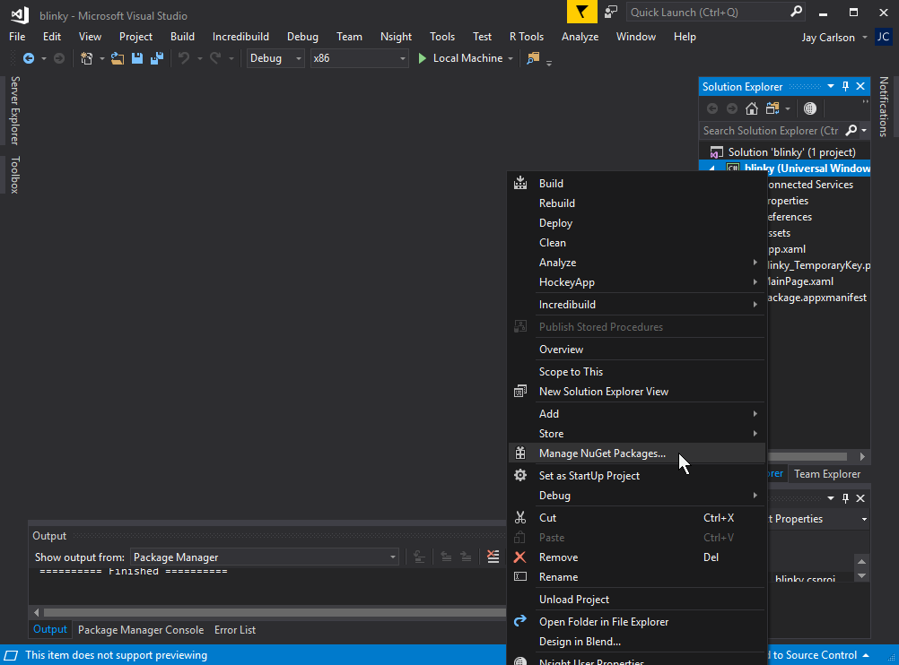
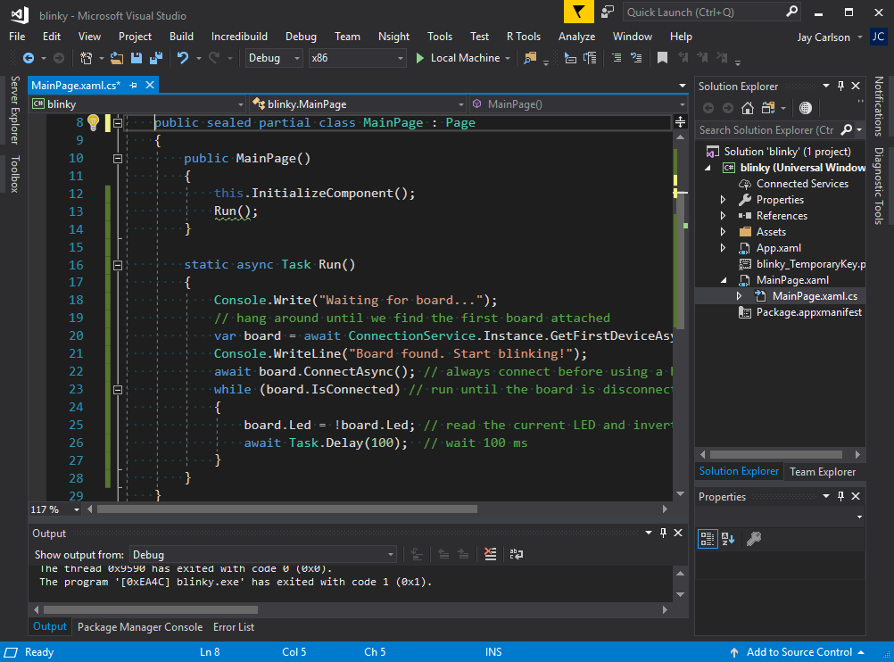
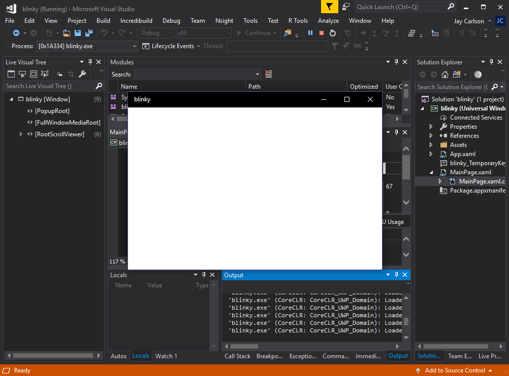

\page windows Windows

%Treehopper provides first-class support for building console and desktop Windows apps that target either class Win32 APIs, or the Windows 10 Universal Windows Platform (UWP). You can also target the new .NET Core 2.0 runtime.

## Prerequisites
You can build C# Linux apps that connect to %Treehopper using both the classic [Mono Project](https://www.mono-project.com/) runtime, or the new [.NET Core 2.0](https://www.microsoft.com/net/learn/get-started/linux/rhel) environment.

If you have an old version of .NET Core, please make sure to update it before proceeding; %Treehopper targets .NET Core 2.0 or later.

### IDEs
The .NET Core 2.0 SDK is well-suited to developers looking for a command-line development environment. While you can use any text editor you'd like, if you jump around between .NET, Javascript, Python, and other languages, [Visual Studio Code](https://code.visualstudio.com/download) is a great lightweight text editor that has good support for .NET Core (including debugging).


# Blinky in .NET Core {#windows-dotnet-core}
We can build a console application that targets .NET Core 2.0. The .NET binaries produced can run on both Linux and Windows.

We'll create the .NET Core project on the command line, but it's just as easy to create it from Visual Studio or Rider.

### Step 1: Create a new project
Create a new folder called "blinky" and execute `dotnet new console` from it to create a new .NET Core console application.

```
> mkdir blinky
> cd blinky
> dotnet new console
```

### Step 2: Add the %Treehopper and %Treehopper.Desktop NuGet packages
The %Treehopper NuGet package contains all the core %Treehopper functionality. %Treehopper.Desktop contains code needed to use %Treehopper with Windows, macOS, or Linux hosts.

Add these packages to your project:
```
> dotnet add package Treehopper
> dotnet add package Treehopper.Desktop
```
Explicitly adding both packages is actually redundant, since if we add the %Treehopper.Desktop NuGet package to the project, it will automatically pull in %Treehopper as a dependency.

### Step 3: Edit Program.cs
Open Program.cs in a text editor and edit it to look like the following:

```CS
using System;
using Treehopper;
using System.Threading.Tasks;

namespace blinky
{
    class Program
    {
        static void Main(string[] args)
        {
            Task.Run(Run).Wait();
        }

        static async Task Run()
        {
            Console.Write("Waiting for board...");
            // hang around until we find the first board attached
            var board = await ConnectionService.Instance.GetFirstDeviceAsync();
            Console.WriteLine("Board found. Start blinking!");
            await board.ConnectAsync(); // always connect before using a board
            while(board.IsConnected) // run until the board is disconnected
            {
                board.Led = !board.Led; // read the current LED and invert it
                await Task.Delay(100);  // wait 100 ms
            }
        }
    }
}
```

### Step 4: Build and run
You can build and run the app by executing
```
> dotnet run
```

_(If you ever want to explicitly `clean` or `build` a project, those are valid commands, too.)_

You should see the LED start blinking continuously once your program launches. If the LED doesn't work or there are errors, check that you copied the code properly.

# Blinky in classic .NET Framework {#windows-win32}
We can build a console application that targets .NET Framework 4.6.1+. Console .NET Framework apps are the easiest way to produce a cross-platform binary that can be run on macOS, Linux, and Windows without recompiling.

We'll create a classic .NET Console application in Visual Studio, but if you're using Rider, it will be a similar process.


### Step 1: Create a new project
Create a new **Console App (.NET Framework)** solution named "blinky" in the directory of your choosing.


### Step 2: Add the %Treehopper and %Treehopper.Desktop NuGet packages
The %Treehopper NuGet package contains all the core board functionality. %Treehopper.Desktop contains code needed to use %Treehopper with Windows, macOS, or Linux hosts.

To add these packages, right-click on the blinky project (not the solution), and choose **Manage NuGet Packages...**. Search for _%Treehopper_ and add both **%Treehopper** and **%Treehopper.Desktop** packages.

Explicitly adding both packages is actually redundant, since if we add the %Treehopper.Desktop NuGet package to the project, it will automatically pull in %Treehopper as a dependency.


### Step 3: Edit Program.cs
Open Program.cs and edit it to look like the following:

```CS
using System;
using Treehopper;
using System.Threading.Tasks;

namespace blinky
{
    class Program
    {
        static void Main(string[] args)
        {
            Task.Run(Run).Wait();
        }

        static async Task Run()
        {
            Console.Write("Waiting for board...");
            // hang around until we find the first board attached
            var board = await ConnectionService.Instance.GetFirstDeviceAsync(); 
            Console.WriteLine("Board found. Start blinking!");
            await board.ConnectAsync(); // always connect before using a board
            while(board.IsConnected) // run until the board is disconnected
            {
                board.Led = !board.Led; // read the current LED and invert it
                await Task.Delay(100);  // wait 100 ms
            }
        }
    }
}
```


### Step 4: Build and run
To build the program and start debugging, press the Start button in the middle of the toolbar, or choose **Debug > Start Debugging** (F5).

You should see the LED start blinking continuously once your program launches. If the LED doesn't work or there are errors, check that you copied the code properly.


# Blinky in Windows 10 UWP {#windows-uwp}
We'll use Visual Studio 2017 to create a Windows 10 UWP application.


### Step 1: Create a new project
Create a new **Blank App (Universal Windows)** solution named "blinky" in the directory of your choosing. Choose _Windows 10 Fall Creators Update_ for both **Target version** and **Minimum version**.


### Step 2: Edit appxmanifest
We need to declare a USB capability in the package manifest. While many capabilities can be declared using the graphical editor, this one cannot; you must right-click on _Package.appxmanifest_ and choose **View Code**.

Add the following into the _Capabilities_ section:

```
<DeviceCapability Name="usb">
    <Device Id="vidpid:10c4 8a7e">
    <Function Type="classId:ff * *" />
    </Device>
</DeviceCapability>
```

(0x10c4 is %Treehopper's VID, and 0x8a7e is %Treehopper's PID)


### Step 3: Add the %Treehopper and %Treehopper.Uwp NuGet packages
The %Treehopper NuGet package contains all the core board functionality. %Treehopper.Uwp contains code needed to use %Treehopper with Windows 10 devices.

To add these packages, right-click on the blinky project (not the solution), and choose **Manage NuGet Packages...**. Search for _%Treehopper_ and add both **%Treehopper** and **%Treehopper.Uwp** packages.

Explicitly adding both packages is actually redundant, since if we add the %Treehopper.Uwp NuGet package to the project, it will automatically pull in %Treehopper as a dependency.


### Step 4: Edit MainPage.xaml.cs
Expand MainPage.xaml and open MainPage.xaml.cs to edit it to look like the following:

```CS
using System;
using System.Threading.Tasks;
using Treehopper;
using Windows.UI.Xaml.Controls;

namespace blinky
{
    public sealed partial class MainPage : Page
    {
        public MainPage()
        {
            this.InitializeComponent();
            Run();
        }

        static async Task Run()
        {
            Console.Write("Waiting for board...");
            // hang around until we find the first board attached
            var board = await ConnectionService.Instance.GetFirstDeviceAsync();
            Console.WriteLine("Board found. Start blinking!");
            await board.ConnectAsync(); // always connect before using a board
            while (board.IsConnected) // run until the board is disconnected
            {
                board.Led = !board.Led; // read the current LED and invert it
                await Task.Delay(100);  // wait 100 ms
            }
        }
    }
}

```


### Step 5: Build and run
To build the program and start debugging, press the Start button in the middle of the toolbar, or choose **Debug > Start Debugging** (F5).

A blank window will appear, and you should see the LED start blinking continuously once your program launches. If the LED doesn't work or there are errors, check that you copied the code properly.

# Next steps
Before moving on, make sure you're familiar with what's going on in the code. What happens if you start up the app before plugging in a board?

As a next step, try hooking up an LED to Pin 0 and edit the program to toggle that pin instead of the onboard LED (Hint, check out Pin.ToggleOutput()).

From here, you can dive right into using other peripherals on %Treehopper, as well as components from %Treehopper.Libraries (make sure to add the %Treehopper.Libraries NuGet package first!).