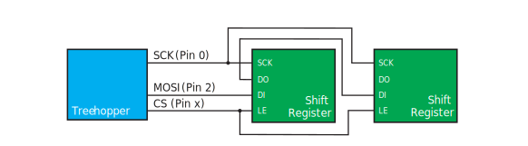
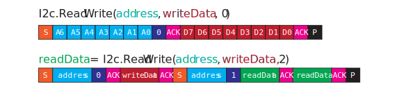
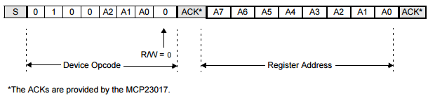

# Core Hardware

Treehopper boards have up to 20 pins — each of which can be used as analog inputs, digital inputs, or digital outputs. Many of these pins also have dedicated peripheral functions for SPI, I2C, UART, and PWM.

# Digital & Analog Pins {#pins}
Each Treehopper pin functions can read and output digital values, as well as read analog voltages.

## Pin Mode
You can choose whether a pin should be a digital input, output, or analog input by setting the pin's mode property. Consult the API documentation for the language you're using to determine how to set the pin mode.

## Digital outputs
All pins on Treehopper support both push-pull and open-drain outputs. Writing a true or false to the pin's digital value will flush that value to the pin.
### Push-Pull
Push-pull is the commonly used output mode; when a pin is set to true, Treehopper will attempt to drive the pin to logic HIGH (3.3V) — when a pin is set to false, Treehopper will attempt to drive the pin to logic LOW (0V — also referred to as ground).
### Open-Drain
Open-drain outputs can only drive a strong logic LOW (0V); in the other state, the pin is allowed to float.
### Output Current Limitations
Treehopper can source approximately 20 mA of current out of each pin when short-circuited. Treehopper can sink approximately 40 mA of current into each pin when short-circuited. While this is plenty of current for peripheral ICs and small indicator LEDs, do not expect to drive large arrays of LEDs, or low-impedance loads like motors, solenoids, or speakers directly from Treehopper's pins. There are a wide variety of peripherals in the Treehopper.Libraries namespace that can be used for interfacing with these peripherals.
\warning <b>To avoid damaging the device permanently, do not source or sink more than 400 mA of combined current out of the pins on the board!</b> Note that these limits have nothing to do with the supply pins found on Treehopper; you can comfortably source 500 mA out of either the 5V or 3.3V supply pins on the board.
## Digital input {#pins_digitalin}
Treehopper's digital inputs are used to sample digital signals — i.e., signals that have either a <i>LOW</i> or <i>HIGH</i> state. A <i>LOW</i> is considered a voltage less than or equal to 0.6V. Logic <b>HIGH</b> is considered a voltage greater than or equal to 2.7V.

Treehopper pins are 5V-tolerant; note that this means there is a 5V-capable protection diode shunting to VDD (3.3V) -- it does not mean you can drive a low-impedance (strong) 5V signal into a pin; if you have 5V outputs from peripherals or other devices that you wish to use, please place a resistor in series with the signal to limit current:

\warning <b>Do not exceed 5.8V on any pin at any time or you will permanently damage the board</b>.

Treehopper digital pins are sampled continuously onboard; when any pin changes, this data is sent to the host device. 

## Analog inputs
Unlike many embedded platforms, each Treehopper pin can be read using the on-board 12-bit ADC. There is no limit to the total number of analog pins activated at any time. 

### Output Format
When the pin is sampled and sent to the host, the value is simultaneously available to the user in three forms:
 - <b>AdcValue</b> -- the raw, 12-bit result from conversion.
 - <b>AnalogValue</b> -- the normalized value of the ADC (from 0-1).
 - <b>AnalogVoltage</b> -- the actual voltage at the pin (taking into account the reference level).

### Reference Levels
Each pin has a configurable reference level that can be used to measure the pin against. The reference levels are:
 - 3.3V generated by the on-board LDO, rated at 1.5% accuracy (default).
 - 3.6V (effective) reference derived from the on-chip 1.8V reference.
 - 2.4V on-chip reference rated at 2.1% accuracy.
 - 1.8V on-chip reference.
 - 1.65V on-chip reference, 1.8% accurate.
 - 3.3V (effective) reference that is derived from the on-chip 1.65V reference.

 For most ratiometric applications --- i.e., when measuring a device whose output is ratioed to its power supply --- connect the sensor's power supply to the 3.3V supply pin the Treehopper and use the default 3.3V reference. The other reference options are provided for advanced scenarios that involve reading from precision voltage outputs accurately.

## Performance Considerations
Writing values to (or changing pin modes of) Treehopper pins will flush to the OS's USB layer immediately, but there is no way of achieving guaranteed latency. Occasional writes (say, on the order of every 20 ms or more) will usually flush to the port within 0.1-1 ms. If your application is chatty, or the bus you're operating on has other devices (especially isochronous devices like webcams), you may see long periods (several milliseconds) of delay. Analog pins take a relatively long time to sample; if you enable tons of analog inputs, the effective sampling rate will drop by up to two times.

# SPI {#spi}
SPI is a full-duplex synchronous serial interface useful for interfacing with both complex, high-speed peripherals, as well as simple LED drivers, output ports, and any other general-purpose input or output shift register.

The Treehopper.Libraries distribution for your language/platform has support for many different peripherals you can use with the SPI peripheral; see the \ref libraries documentation for more details.

## Pins
Treehopper supports SPI master mode with the following pins:
 - <b>MISO</b> <i>(Master In, Slave Out)</i>: This pin carries data from the slave to the master.
 - <b>MOSI</b> <i>(Master Out, Slave In)</i>: This pin carries data from the master to the peripheral
 - <b>SCK</b> <i>(Serial Clock)</i>: This pin clocks the data into and out of the master and slave device.

Not all devices use all pins, but the SPI peripheral will always reserve the SCK, MISO, and MOSI pin once the peripheral is enabled, so these pins cannot be used for other functions.

## Chip Select
Almost all SPI peripherals also use some sort of chip select <i>(CS)</i> pin, which indicates a valid transaction. Thus, the easiest way to place multiple peripherals on a bus is by using a separate chip select pin for each peripheral (since a peripheral will ignore SPI traffic without a valid chip select signal). Like many MCU platforms, Treehopper implements the chip-select functionality in software, which provides a ton of configurability. There are two chip-select styles:
 - SPI mode: chip-select is asserted at the beginning of a transaction, and de-asserted at the end; and
 - Shift register mode: chip-select is strobed at the end of a transaction
These styles support both active-low and active-high signal polarities; consult the language API for details. Please note that most shift registers refer to their "CS" pin as a "latch enable" (LE) signal.

## SPI Mode
SPI does not specify a transaction-level protocol for accessing peripheral functions (unlike, say, SMBus for I2c does); as a result, peripherals that use SPI have wildly different implementations. Even basic aspects -- when data is clocked, and the polarity of the clock signal -- vary by IC. This property is often called the "SPI mode" of the peripheral; Treehopper supports all four modes:
 - <b>Mode 0 (00):</b> Clock is idle-low. Data is latched in on the clock's rising edge and data is output on the falling edge.
 - <b>Mode 1 (01):</b> Clock is idle-low. Data is latched in on the clock's falling edge and data is output on the rising edge.
 - <b>Mode 2 (10):</b> Clock is idle-high. Data is latched in on the clock's rising edge and data is output on the falling edge.
 - <b>Mode 3 (11):</b> Clock is idle-high. Data is latched in on the clock's falling edge and data is output on the rising edge.

## Clock Speed
Treehopper supports SPI clock rates as low as 93.75 kHz and as high as 24 MHz, but you will not notice performance gains above 6 MHz, since this is the fastest rate that Treehopper's MCU can place bytes into the SPI buffer; any faster, and the SPI peripheral will have to wait for the CPU before transmitting the next byte.

Compared to \ref i2c, SPI is a simpler protocol, generally much faster, and less popular for modern peripheral ICs.

## Chaining Devices & Shift Registers
Treehopper's SPI module works well for interfacing with many types of shift registers, which typically have a single output state "register" that is updated whenever new SPI data comes in. Because of the nature of SPI, any existing data in this register is sent to the MISO pin (sometimes labeled "DO" --- digital output --- or, confusingly, "SO" --- serial output). Thus, many shift registers (even of different types) can be chained together by connecting the DO pin of each register to the DI pin of the next:

In the example above, if both of these shift registers were 8-bit, sending the byte array {0xff, 0x03} would send "0xff" to the right register, and "0x03" to the left one. Most Treehopper language APIs have support for abstracting this functionality.

 ## Further Reading
 Wikipedia has an excellent SPI article: [Serial Peripheral Interface Bus](https://en.wikipedia.org/wiki/Serial_Peripheral_Interface_Bus)

# I2C {#i2c}
I2C (<i>I2C</i>, or <i>IIC</i>) is a low-speed synchronous serial protocol that allows up to 127 ICs to communicate with a master over a shared two-wire open-drain bus. It has largely replaced \ref spi for many sensors and peripherals.

The Treehopper.Libraries distribution for your language/platform has support for many different peripherals you can use with the I2C peripheral; see the \ref libraries documentation for more details.

Here's an example of a typical I2C arrangement:

## Addressing
Each <i>I2C</i> peripheral on the bus must have a unique 7-bit address. This is almost always specified in the datasheet of the peripheral, and might also include the states of one or more address pins — input pins on the chip that can either be permanently tied low or high to control the address. This allows multiple instances of the same IC to be placed on the same bus, so long as the address pins are tied in a unique combination. 

## SMBus
System Management Bus (SMBus) is a protocol definition that sits on top of I2C, and is implemented by almost all modern I2C peripherals. Peripherals expose all functionality through <i>registers</i> (which are similar to the registers of an MCU). SMBus uses an 8-bit value to specify the register, thus supporting 255 addresses. By manipulating these registers, the peripheral can be commanded to perform its functions, and data can also be read back from it.

# Implementation
Treehopper implements an SMBus-compliant I2C master role that is compatible with almost all I2C peripherals on the market. Treehopper does not support multi-master scenarios or I2C slave functionality.

## ReadWrite Function
It would be impractical for Treehopper to directly expose low-level I2C functions (start bit, stop bit, ack/nack); instead, Treehopper's I2C module supports a single high-level `ReadWrite()` function that is used to exchange data.

The signature of this function varies by language, but abstractly, it can be thought of as:

    readData = ReadWrite(address, writeData, numBytesToRead)

This function can be used to either write data to the device (if `NumBytesToRead` is `0`), read data from the device (if `WriteData` is `null`), or both write data to the device and then read from it. 

The name of the function is a bit of a misnomer; the function actually executes a write first, followed by a read from the device. Here's how two example commands get mapped to an actual I2C transaction:

In the first command, the entire address and data bit pattern is illustrated; for compactness, this is omitted in the second example.

# Frequent Issues
It can be difficult to diagnose I2C problems without a logic analyzer, but there are several common issues that arise that can be easily diagnosed without specialized tools.

## Pull-Up Resistors
Treehopper does not have on-board I2C pull-up resistors on the SCL and SDA pins, as this would interfere with analog inputs on these pins. There are methodologies for selecting these resistors, but there's quite a bit of latitude -- we've found 4.7-10k resistors seem to work almost all the time, with normal numbers of slaves (say, fewer than 10) on a bus. If you have fewer slaves, you may need to decrease these resistor values.

Note that many off-the-shelf modules you might buy from [Adafruit](https://www.adafruit.com), [SparkFun](https://www.sparkfun.com), [Amazon](https://www.amazon.com/)</a> or an [eBay](https://www.ebay.com/) vendor probably already have I2C pull-up resistors on them. It is usually not an issue if you have more than one of these modules on the bus, but depending on the pull-up resistor values use, the ICs may struggle to drive the bus with a large number of pull-up resistors on it.

## Addressing
At the protocol level, the device's 7-bit address is shifted to the left by 1, leaving the least-significant bit to be used to indicate a 1 for <i>Input</i> (read), and a 0 for <i>Output</i> (write) transactions. The Treehopper API (and all Treehopper libraries) use this 7-bit address. Unfortunately, the datasheets for some peripherals specify the peripheral's address in this shifted 8-bit format. To add further confusion, many peripherals have external address pins that can be tied high or low to set or clear the respective address bits. For example, Figure 1-4 from the MCP23017 datasheet gives

To determine what address to use with Treehopper, ignore the R/W bit completely, thus the 7-bit address is 0b0100(a2)(a1)(a0). If we were to tie A0 high while leaving A1 and A2 low, the address would be 0b0100001, which is 0x21.

## Address Conflicts
With only 127 different I2C addresses available, it's actually quite common for ICs to have conflicting addresses. And some ICs --- especially low pin-count sensors --- lack external address pins that can be used to set the address. While many of these devices have a programmable address, this is an annoying chicken-and-the-egg problem that requires you to individually program the addresses of the ICs before they're installed together on your board.

Some language APIs have <b>I2cMux</b>-inherited components in the Treehopper.Libraries.Interface.Mux namespace that might be useful for handling address conflicts. For example, this [I2cAnalogMux C# class](/Documentation/C-Sharp/class_treehopper_1_1_libraries_1_1_interface_1_1_mux_1_1_i2c_analog_mux.html) allows you to use low-cost analog muxes (such as jellybean 405x-type parts that are often just a few cents each) as a transparent mux to share one Treehopper I2C bus with multiple slaves with conflicting addresses. 

## Logic-Level Conversion
Treehopper is a 3.3V device, which almost all modern peripheral ICs use as their recommended operating (or at least I/O) voltage. Furthermore, because I2C is an open-drain interface, logic-level conversion is usually not necessary when dealing with peripherals that operate anywhere between 2.8 and 5V. This range covers the vast majority of ICs in use today.

If your 5V device has TTL-compatible logic (i.e., a VIH of 2V), no logic-level conversion is needed -- you can simply wire these devices directly to Treehopper's SCL and SDA pins, making sure to pull them up to 3.3V. Since TTL specifies a minimum high voltage of 2V, the 3.3V signals generated by the pull-ups is sufficient. If the 5V device has a CMOS-compatible input, you should consider pulling up the SCL and SDA lines to 5V instead. The clamping diodes on Treehopper's I/O pins will limit the effective voltage to about 3.5 or 3.6V, which should be sufficient for CMOS-compatible inputs that require 3.5V (see \ref pins_digitalin for more information on input voltages). Some old ICs have extremely high minimum voltage inputs --- as high as 4.5V. In this case, you'll need to build or buy a bidirectional logic level converter.

On the opposite end of the spectrum, if you're dealing with 2.8V devices, make sure to pull up the bus to 2.8 --- not 3.3 --- volts. If you have lower-voltage devices, you'll need to build or buy a bidirectional logic level converter (which can be [as simple as a transistor and some pull-ups](http://www.nxp.com/documents/application_note/AN10441.pdf)). 

# UART {#uart}
The UART peripheral allows you to send and receive standard-format RS-232-style asynchronous serial communications. 

## Pins
When the UART is enabled, the following pins will be unavailable for other use:
 - <b>TX</b> <i>(Transmit)</i>: This pin carries data from Treehopper to the device you've attached to the UART.
 - <b>RX</b> <i>(Receive)</i>: This pin carries data from the device to Treehopper.

Note that UART cross-over is a common problem when people are attaching devices together; always consult the documentation for the device you're attaching to Treehopper to ensure that the TX signal from Treehopper is flowing into the receive input (RX, DIN, etc) of the device, and vice-versa. Since you are unlikely to damage either device by misconnecting, it is a common troubleshooting practice to simply swap TX and RX if the system doesn't appear to be functioning properly.

## One-Wire Mode
Treehopper's UART has built-in support for One-Wire mode with few external circuitry requirements. When you use the UART in One-Wire mode, the TX pin will switch to an open-drain mode. You must physically tie the RX and TX pins together --- this is the data pin for the One-Wire bus. Most One-Wire sensors and devices you use will require an external pull-up resistor on the bus.

While One-Wire mode uses the UART, all its routines --- including searching --- are implemented in firmware on the Treehopper board itself, instead in the host-side software. This should provide good performance without being overly chatty over the USB interface.

## Implementation Details
Treehopper's UART is designed for average baud rates; the range of supported rates is 7813 baud to 2.4 Mbaud, though communication will be less reliable above 1-2 Mbaud.

Transmitting data is straightforward: simply pass a byte array --- up to 63 characters long --- to the Send() function once the UART is enabled. Consult the appropriate language API for details.

Receiving data is more challenging, since incoming data can appear on the RX pin at any moment when the UART is enabled. Since all actions on Treehopper are initiated on the host, to get around UART's inherent asynchronicity, a 32-byte buffer holds any received data that comes in while the UART is enabled. Then, when the host wants to access this data, it can Receive() it from the board to obtain the buffer (consule your language API for the specifics).

Whenever Receive() is called, the entire buffer is sent to the host, and the buffer's pointer is reset to 0 (i.e., the buffer is reset). This can be useful for clearing out any gibberish and returning the UART to a known state before you expect to receive data --- for example, if you're addressing a device that you send commands to, and read responses back from, you may wish to call Receive() before sending the command; that way, parsing the received data will be simpler.

## Other Considerations
This ping-pong short-packet-oriented back-and-forth scenario is what Treehopper's UART is built for, as it's what's most commonly needed when interfacing with embedded devices that use a UART. 

There is a tight window of possible baud rates where it is plausible to receive data continuously without interruption. For example, at 9600 baud, the Receive() function only need to finish execution every 33 milliseconds, which can easily be accomplished in most operating systems. However, because data is not double-buffered on the board, under improbable circumstances, continuously-transmitted data may inadvertently be discarded.

Treehopper's UART is not designed to replace a high-quality CDC-class USB-to-serial converter, especially for high data-rate applications. In addition to streaming large volumes of data continuously, USB CDC-class UARTs should also offer lower latency for receiving data. Treehopper also has no way of exposing its UART to the operating system as a COM port, so it's most certainly not a suitable replacement for a USB-to-serial converter in most applications.

# PWM {#pwm}
Treehopper has three high-resolution 16-bit PWM channels.