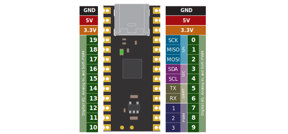

\page getting-started Getting Started

This page is designed to help people new to Treehopper get started programming the board quickly.

# Supported Hosts
To interact with Treehopper, you write software that runs on your computer, laptop, smartphone, tablet, or embedded host. This software calls into the Treehopper API for your language.

To learn more about supported hosts, visit the \ref hosts page.

# Verify
The first step is to verify your board works by running a pre-built demo. Please visit [Getting Started](https://treehopper.io/get-started) for links to download ready-to-run demos for your device.

# Core Hardware

Treehopper is a USB 2.0 Full Speed device with up to 20 pins — each of which can be used as an analog input, digital input, or digital output. Many of these pins also have dedicated peripheral functions for SPI, I2C, UART, and PWM.

# Language support
Treehopper's SDK has native APIs for C#, Python, Java, and C++. Other languages, platforms, and environments that can call into libraries built in these languages also work with Treehopper; MATLAB is an example of such an environment. 

## Treehopper is just a library
This may not be obvious to beginners (especially coming from platforms like Arduino), but the Treehopper SDK isn't an environment, framework, or language --- it's just a library. 

Treehopper integrates into your software the same way that any other third-party library would: you typically install the library using a package manager (or building from source manually), and you call into the library to access its functionality.

## Choosing a language
For large projects where Treehopper plays a minor role, you've probably got the language and environment already selected; however, if the focal point of the app is the Treehopper board, you may want to read the API documentation to determine which language has the right features for your project.

Visit the \ref languages page to see a full comparison.

