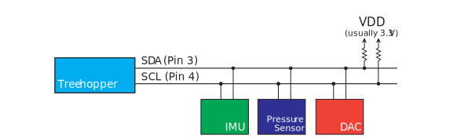

\page i2c I2C

I2C (<i>I2C</i>, or <i>IIC</i>) is a low-speed synchronous serial protocol that allows up to 127 ICs to communicate with a master over a shared two-wire open-drain bus. It has largely replaced \ref spi for many sensors and peripherals.

The Treehopper.Libraries distribution for your language/platform has support for many different peripherals you can use with the I2C peripheral; see the \ref libraries documentation for more details.

Here's an example of a typical I2C arrangement:

## Addressing
Each <i>I2C</i> peripheral on the bus must have a unique 7-bit address. This is almost always specified in the datasheet of the peripheral, and might also include the states of one or more address pins — input pins on the chip that can either be permanently tied low or high to control the address. This allows multiple instances of the same IC to be placed on the same bus, so long as the address pins are tied in a unique combination. 

## SMBus
System Management Bus (SMBus) is a protocol definition that sits on top of I2C, and is implemented by almost all modern I2C peripherals. Peripherals expose all functionality through <i>registers</i> (which are similar to the registers of an MCU). SMBus uses an 8-bit value to specify the register, thus supporting 255 addresses. By manipulating these registers, the peripheral can be commanded to perform its functions, and data can also be read back from it.

# Implementation
Treehopper implements an SMBus-compliant I2C master role that is compatible with almost all I2C peripherals on the market. Treehopper does not support multi-master scenarios or I2C slave functionality.

## SendReceive Function
It would be impractical for Treehopper to directly expose low-level I2C functions (start bit, stop bit, ack/nack); instead, Treehopper's I2C module supports a single high-level `SendReceive()` function that is used to exchange data.

The exact signature of this function varies by language, but essentially, it can be thought of as:

    readData = SendReceive(address, writeData, numBytesToRead)

This function can be used to either write data to the device (if `numBytesToRead` is `0`), read data from the device (if `writeData` is `null`), or both write data to the device and then read from it. 

Here's how two example commands get mapped to an actual I2C transaction:

In the first command, the entire address and data bit pattern is illustrated; for compactness, this is omitted in the second example.

# Frequent Issues
It can be difficult to diagnose I2C problems without a logic analyzer, but there are several common issues that arise that can be easily diagnosed without specialized tools.

## Pull-Up Resistors
Treehopper does not have on-board I2C pull-up resistors on the SCL and SDA pins, as this would interfere with analog inputs on these pins. There are methodologies for selecting these resistors, but there's quite a bit of latitude -- we've found 4.7-10k resistors seem to work almost all the time, with normal numbers of slaves (say, fewer than 10) on a bus. If you have fewer slaves, you may need to decrease these resistor values.

Note that many off-the-shelf modules you might buy from [Adafruit](https://www.adafruit.com), [SparkFun](https://www.sparkfun.com), [Amazon](https://www.amazon.com/)</a> or an [eBay](https://www.ebay.com/) vendor probably already have I2C pull-up resistors on them. It is usually not an issue if you have more than one of these modules on the bus, but depending on the pull-up resistor values use, the ICs may struggle to drive the bus with a large number of pull-up resistors on it.

## Addressing
At the protocol level, the device's 7-bit address is shifted to the left by 1, leaving the least-significant bit to be used to indicate a 1 for <i>Input</i> (read), and a 0 for <i>Output</i> (write) transactions. The Treehopper API (and all Treehopper libraries) use this 7-bit address. Unfortunately, the datasheets for some peripherals specify the peripheral's address in this shifted 8-bit format. To add further confusion, many peripherals have external address pins that can be tied high or low to set or clear the respective address bits. For example, Figure 1-4 from the MCP23017 datasheet gives

To determine what address to use with Treehopper, ignore the R/W bit completely, thus the 7-bit address is 0b0100(a2)(a1)(a0). If we were to tie A0 high while leaving A1 and A2 low, the address would be 0b0100001, which is 0x21.

## Address Conflicts
With only 127 different I2C addresses available, it's actually quite common for ICs to have conflicting addresses. And some ICs --- especially low pin-count sensors --- lack external address pins that can be used to set the address. While many of these devices have a programmable address, this is an annoying chicken-and-the-egg problem that requires you to individually program the addresses of the ICs before they're installed together on your board.

Some language APIs have <b>I2cMux</b>-inherited components in the Treehopper.Libraries.Interface.Mux namespace that might be useful for handling address conflicts. For example, this [I2cAnalogMux C# class](/Documentation/C-Sharp/class_treehopper_1_1_libraries_1_1_interface_1_1_mux_1_1_i2c_analog_mux.html) allows you to use low-cost analog muxes (such as jellybean 405x-type parts that are often just a few cents each) as a transparent mux to share one Treehopper I2C bus with multiple slaves with conflicting addresses. 

## Logic-Level Conversion
Treehopper is a 3.3V device, which almost all modern peripheral ICs use as their recommended operating (or at least I/O) voltage. Furthermore, because I2C is an open-drain interface, logic-level conversion is usually not necessary when dealing with peripherals that operate anywhere between 2.8 and 5V. This range covers the vast majority of ICs in use today.

If your 5V device has TTL-compatible logic (i.e., a VIH of 2V), no logic-level conversion is needed -- you can simply wire these devices directly to Treehopper's SCL and SDA pins, making sure to pull them up to 3.3V. Since TTL specifies a minimum high voltage of 2V, the 3.3V signals generated by the pull-ups is sufficient. If the 5V device has a CMOS-compatible input, you should consider pulling up the SCL and SDA lines to 5V instead. The clamping diodes on Treehopper's I/O pins will limit the effective voltage to about 3.5 or 3.6V, which should be sufficient for CMOS-compatible inputs that require 3.5V (see \ref pins_digitalin for more information on input voltages). Some old ICs have extremely high minimum voltage inputs --- as high as 4.5V. In this case, you'll need to build or buy a bidirectional logic level converter.

On the opposite end of the spectrum, if you're dealing with 2.8V devices, make sure to pull up the bus to 2.8 --- not 3.3 --- volts. If you have lower-voltage devices, you'll need to build or buy a bidirectional logic level converter (which can be [as simple as a transistor and some pull-ups](http://www.nxp.com/documents/application_note/AN10441.pdf)).