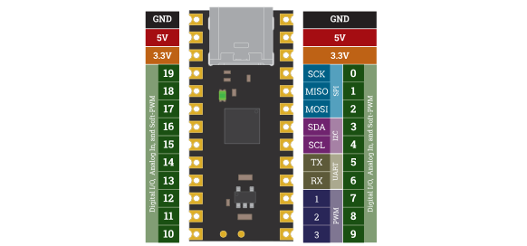

\mainpage Welcome

# Introduction

This is the main documentation set for Treehopper — here, we focus on overall concepts you'll need to understand how to get going. We'll also dive deep into hardware functionality, performance considerations, and anything else that is language-agnostic.

If you're looking for API references for a particular language, here are the links:
- [C# API Documentation](/c-sharp)
- [Python API Documentation](/python)
- [Java API Documentation](/java)
- [C++ API Documentation](/cpp)

## What is Treehopper?
Treehopper is a USB peripheral for your computer, smartphone, or tablet that enables software you write to interface with physical hardware.

## Why?
Most computers and devices are really good at interfacing with high-speed devices like monitors, cameras, VR headsets, audio interfaces, and video capture cards. But they're *really bad* at interfacing with simple peripherals, like buttons, LEDs, low-speed sensors, and motors.

Treehopper is an interface board that endows your computer, smartphone, tablet, or other devices with the same peripherals that microcontrollers have.

# Core Hardware {#core-hardware}
Treehopper is a USB 2.0 Full Speed device with 20 pins — each of which can be used as an analog input, digital input, or digital output. Many of these pins also have dedicated peripheral functions for SPI, I2C, UART, and PWM.

# Language support
Treehopper's SDK has native APIs for C#, Python, Java, and C++. Additionally, many other environments, like MATLAB, can call into Treehopper DLLs and managed assemblies.

Treehopper's SDK and firmware are open source. Visit our [GitHub repo](https://github.com/treehopper-electronics/treehopper-sdk) for more information about contributing.

# Getting Started {#getting-started}
You can get up and running quickly without having to write any software. 

Just grab the Treehopper App from the [Downloads page](https://treehopper.io/downloads) and install it on your device.

## Writing your first app
We have getting started guides for each SDK language:
 - [Getting started in C#/.NET](/c-sharp/get-started)
 - [Getting started in Python](/python/get-started)
 - [Getting started in Java](/java/get-started)
 - [Getting started in C++](/cpp/get-started)